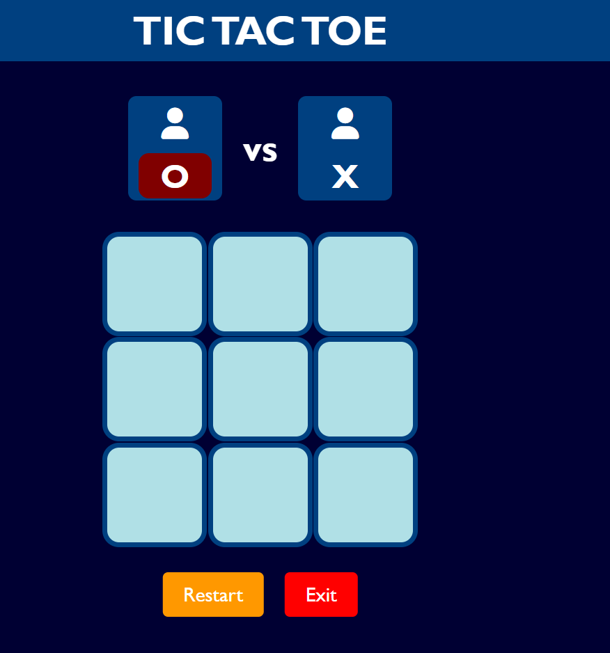

# Tic-Tac-Toe
A fun and engaging Tic Tac Toe game with a vibrant UI, built using HTML, CSS, and JavaScript.

Description

This is a Tic Tac Toe game implemented using HTML, CSS, and JavaScript. The game allows two players to compete by taking turns to place their symbols ("X" and "O") on a 3x3 grid. The first player to align three symbols in a row, column, or diagonal wins the game. The project includes a visually appealing design with the following features:

Maroon color for "O" and yellow color for "X".
A dark blue background for the overall page.
Light cyan for the grid cells.
It also highlights the player 
Highlighted grid cells for the winning combination.
Orange "Restart" button and Red "Exit" button.
Green color for the winner announcement.
Orange for a draw game 

Features

Interactive Gameplay:

Players can click on the grid cells to place their symbols.
The game highlights the winning combination if a player wins.
Highlights the current player's turn.
Game logic prevents players from selecting already-filled cells.
Displays a winning message for the winner in green text.

UI Design:

Clean and modern design with vibrant colors.
Player indicators showing current turns.
Restart button to reset the game without refreshing the page.
Exit button to quit the game.

## Demo
Here is a preview of the Tic Tac Toe game interface:

